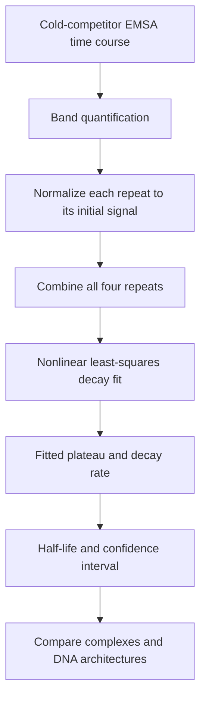

# Cold-Competitor EMSA Analysis of Notch Complex Stability

### Exponential decay fitting of protein–DNA binding measurements to estimate complex half-lives and their uncertainty.

## Table of Contents

- [Overview](#overview)
- [Goal](#goal)
- [Scientific Context](#scientific-context)
- [Computational Pipeline](#computational-pipeline)
- [Data Preparation and Normalization](#data-preparation-and-normalization)
- [Exponential Decay Modeling](#exponential-decay-modeling)
- [Parameter Fitting and Uncertainty](#parameter-fitting-and-uncertainty)
- [Results](#results)
- [Key Findings](#key-findings)
- [Repository Structure](#repository-structure)
- [Requirements and Analysis Workflow](#requirements-and-analysis-workflow)
- [Related Work: Equilibrium Binding and Cooperativity](#related-work-equilibrium-binding-and-cooperativity)
- [Publication](#publication)

---

## Overview

This repository contains the original MATLAB scripts linked in the [Kuang et al. (2021)](https://doi.org/10.1371/journal.pgen.1009039) paper. The analysis is now organized across two repositories:

- My **[multi-model-cooperativity-inference](https://github.com/Eafergan/multi-model-cooperativity-inference)** repository provides the main scientific background and detailed explanation of the equilibrium binding model and cooperativity analysis presented in Figure 1.
- **This repository** focuses on exponential decay fitting of cold-competitor EMSA data to estimate protein–DNA complex half-lives, as presented in Figure 2.

The original scripts for both analyses remain here to preserve the code linked from the paper.

## Goal

The goal is to **compare how long activating and repressing complexes remain bound to different DNA-site architectures after adding competitor DNA**.

The analysis converts the measured decay curves into a common set of parameters, allowing complex stability to be compared between conditions.

## Scientific Context

The experiment compares the **NICD/Su(H)/Mastermind activating complex (NCM)** and the **Su(H)/Hairless repressing complex** on two probes: head-to-tail **CSL** sites and head-to-head **SPS** sites.

After complex formation, a **10-fold excess of unlabeled CSL DNA probes** was added. This “cold competitor” competes for protein binding, and EMSA follows the loss of complexes from the labeled probes. [Experimental design and Figure 2](https://journals.plos.org/plosgenetics/article?id=10.1371/journal.pgen.1009039#pgen-1009039-g002)

The measured quantity is the remaining signal in a selected bound-probe band. Its decay describes the persistence of that occupancy state under the competition conditions.

## Computational Pipeline



[`Fit_Fig2.m`](Fit_Fig2.m) starts from the quantified measurements stored in the script. Image quantification is performed before this MATLAB workflow.

## Data Preparation and Normalization

The script contains eight measurement matrices. Each has **seven time points and four experimental repeats**:

$$
t = [0, 60, 120, 180, 240, 300, 600]\ \mathrm{s}
$$

The variable names identify the complex, number of occupied sites, and probe:

| Complex and probe | Doubly occupied band | Singly occupied band |
|---|---|---|
| NCM on SPS | `NCM2SPS` | `NCM1SPS` |
| NCM on CSL | `NCM2CSL` | `NCM1CSL` |
| Su(H)/Hairless on SPS | `H2SPS` | `H1SPS` |
| Su(H)/Hairless on CSL | `H2CSL` | `H1CSL` |

Each repeat is normalized to its own initial value:

$$
y_r(t) = \frac{I_r(t)}{I_r(0)}
$$

where $I_r(t)$ is the measured band signal for repeat $r$. Every normalized trace therefore starts at 1.

The four repeats are then arranged into **28 observations**, with each time point appearing four times. All observations enter the same fit, preserving the individual measurements instead of fitting only their average.

## Exponential Decay Modeling

The normalized signal is described by an **exponential decay with a residual plateau**:

$$
F(t) = (1-c_1)e^{-c_2t} + c_1
$$

| Parameter | Meaning |
|---|---|
| $F(t)$ | Normalized bound-probe signal at time $t$ |
| $c_1$ | Fitted residual signal or plateau |
| $c_2$ | Decay-rate constant, in $\mathrm{s}^{-1}$ |

The model starts at $F(0)=1$ and approaches $c_1$ at long times. Allowing a nonzero plateau accounts for the signal that remains over the measured time course.

The half-life of the decaying component is:

$$
t_{1/2} = \frac{\ln 2}{c_2}
$$

At this time, the signal above the plateau has fallen by half, so $F(t_{1/2})=(1+c_1)/2$.

## Parameter Fitting and Uncertainty

I used MATLAB's **nonlinear least-squares fitting** to estimate $c_1$ and $c_2$ from the pooled repeats. The fit minimizes:

$$
L(c_1,c_2) = \sum_{r=1}^{4}\sum_{i=1}^{7}
\left[F(t_i;c_1,c_2)-y_r(t_i)\right]^2
$$

In the supplied script, both coefficients are bounded between 0 and 1, with initial values of `[0.001, 0.001]`. The fitted coefficients are stored in `fitval`.

The call `confint(tempfit)` returns **95% confidence bounds** for the fitted coefficients. These are calculated from the fit; the Figure 2 script does not perform bootstrap resampling. [MATLAB documentation](https://www.mathworks.com/help/curvefit/cfit.confint.html)

The decay-rate bounds are converted to half-life bounds using the same inverse relationship. For positive rate bounds $c_{2,\mathrm{low}}$ and $c_{2,\mathrm{high}}$:

$$
t_{1/2,\mathrm{low}} = \frac{\ln 2}{c_{2,\mathrm{high}}},
\qquad
t_{1/2,\mathrm{high}} = \frac{\ln 2}{c_{2,\mathrm{low}}}
$$

The order reverses because a faster decay means a shorter half-life. In the script, `halflifeerr` stores the transformed **upper bound first and lower bound second**; these are interval endpoints, not symmetric error bars.

## Results

The following values are reported in [Figure 2E of the paper](https://journals.plos.org/plosgenetics/article?id=10.1371/journal.pgen.1009039#pgen-1009039-g002):

| Doubly occupied complex | Probe | Half-life (s) | 95% confidence interval (s) |
|---|---|---|---|
| 2NCM | SPS | 65.39 | 57.63–75.56 |
| 2NCM | CSL | 16.25 | 15.00–17.74 |
| 2Su(H)/Hairless | SPS | 14.07 | 13.20–15.07 |
| 2Su(H)/Hairless | CSL | 18.02 | 16.96–19.21 |

The paper notes that rapid dissociation limits the temporal accuracy of these estimates.

## Key Findings

- **Doubly bound NCM persists longer on SPS than on CSL.**
- **Su(H)/Hairless shows similarly rapid decay on both probes.**
- The kinetic comparison supports greater stability of the cooperative NCM complex on SPS. [Figure 2](https://journals.plos.org/plosgenetics/article?id=10.1371/journal.pgen.1009039#pgen-1009039-g002)

## Repository Structure

```text
EMSA-Kuang-et-al/
├── README.md
├── Fit_Fig2.m
├── EMSA_Fit_fig1.m
└── figure_builder_fig1.m
```

| File | Purpose |
|---|---|
| [`Fit_Fig2.m`](Fit_Fig2.m) | Cold-competitor measurements, normalization, exponential decay fitting, confidence intervals, and comparison plots |
| [`EMSA_Fit_fig1.m`](EMSA_Fit_fig1.m) | Equilibrium occupancy fitting using a vectorized parameter grid and parallel parametric bootstrap |
| [`figure_builder_fig1.m`](figure_builder_fig1.m) | Figure 1 binding curves using experimental occupancy data and stored fitted parameters |

## Requirements and Analysis Workflow

The cold-competitor analysis requires **MATLAB with Curve Fitting Toolbox** for `fitoptions`, `fit`, `coeffvalues`, and `confint`. Its measurement arrays are included directly in `Fit_Fig2.m`; no external spreadsheet is needed.

### Fitting a Selected Dataset

1. Open `Fit_Fig2.m` in MATLAB.
2. Choose the dataset at `yValN=NCM1CSL';`. The current selection is the **singly occupied NCM band on CSL**. To fit the doubly occupied NCM band on SPS, for example, use `yValN=NCM2SPS';`.
3. Run the script. It clears the workspace, loads the embedded data, normalizes the selected repeats, and fits their combined observations.
4. Inspect `fitval` for the plateau and decay rate, `ci` for their confidence bounds, and `halflife` and `halflifeerr` for the half-life and its bounds.
5. Record the results before selecting another dataset and running again.

### Plotting the Comparisons

The plotting sections use **previously stored coefficients in `c1c2` and normalized measurements in `allvals`**. These arrays follow the order of the eight datasets listed at the beginning of the script:

`NCM2SPS`, `NCM1SPS`, `NCM2CSL`, `NCM1CSL`, `H2SPS`, `H1SPS`, `H2CSL`, `H1CSL`.

The plots select rows **1, 3, 5, and 7**, corresponding to the doubly occupied bands. Running the script fits the selected `yValN` dataset but does **not** automatically replace the stored coefficients used in these plots. If the measurements or fits are changed, update the corresponding plotting arrays as well.

The script opens separate NCM and Hairless comparisons and a combined comparison. Plots use time in seconds and normalized signal from 0 to 1.
Figures can be saved from MATLAB.

## Related Work: Equilibrium Binding and Cooperativity

The **first part of this work, corresponding to Figure 1**, is presented in greater detail in [multi-model-cooperativity-inference](https://github.com/Eafergan/multi-model-cooperativity-inference).

That analysis fits the **0-, 1-, and 2-occupied states simultaneously** across protein concentrations using a statistical-mechanics model. It estimates the single-site dissociation constant $K_d$, cooperativity coefficient $C$, and unavailable-site parameter $f$.

The companion README explains the model, joint fitting, MATLAB vectorization, and parallel parametric bootstrap.

Together, the two analyses connect **equilibrium binding behavior** with **the persistence of bound complexes after competition**. The original Figure 1 scripts remain in this repository alongside `Fit_Fig2.m`, preserving the code collection linked from the publication.

## Publication

**Kuang et al. (2021).** *Enhancers with cooperative Notch binding sites are more resistant to regulation by the Hairless co-repressor.* **PLOS Genetics, 17(9), e1009039.** [Read the paper](https://doi.org/10.1371/journal.pgen.1009039).
